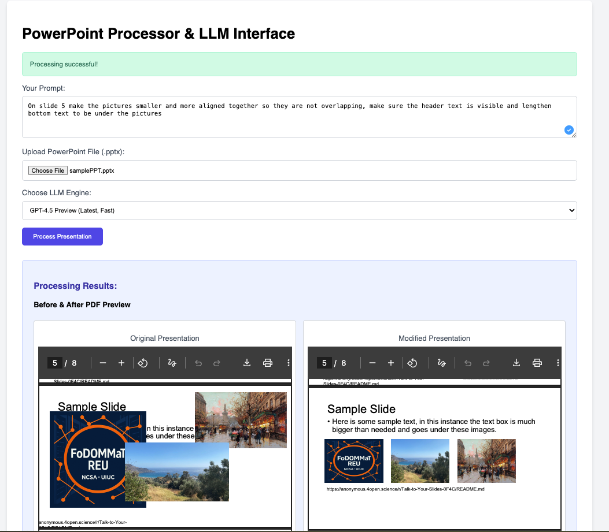

# PPTPilot: AI-Powered PowerPoint Editor

PPTPilot is a web application that lets you edit PowerPoint presentations (`.pptx` files) using the power of Large Language Models (LLMs) like OpenAI's GPT and Google's Gemini. You simply upload your presentation, provide a text prompt describing the changes you want, and PPTPilot works with the LLM to modify the presentation's underlying XML structure. You can then see a before-and-after comparison with PDF previews and download your modified PowerPoint.

## What it Does

* **Upload & Edit:** Upload your `.pptx` files and use natural language prompts to tell the AI what changes to make.
* **LLM Integration:** Choose between powerful LLMs (like Gemini or GPT models) to process your editing requests.
* **XML Modification:** The application intelligently unpacks your PowerPoint, sends its structure and content (as XML and a JSON summary) to the LLM, and then applies the LLM's suggested XML changes to create a new, modified presentation.
* **PDF Previews:** See your original presentation and the AI-modified version side-by-side as PDFs directly in your browser.
* **Download Results:** Download both the original and the modified `.pptx` files.

## Key Features

* **User-Friendly Web Interface:** A simple web page to upload files, enter prompts, and view results.
* **PowerPoint Parsing:** Extracts text, shapes, notes, and XML structure from `.pptx` files.
* **Direct XML Editing:** Modifies presentations by changing their internal XML files based on LLM output.
* **PDF Conversion:** Converts `.pptx` files (original and modified) to `.pdf` for easy viewing, using LibreOffice.
* **Supports Multiple LLMs:** Integrates with both OpenAI (GPT series) and Google Gemini APIs.
* **Detailed Feedback:** Shows the JSON summary of your PPT, the list of its XML files, the full LLM response, and highlights the XML changes made.

## How it Works (Simplified Workflow)

1.  **Upload & Prompt:** You provide a natural language prompt (e.g., "Change the title on slide 1 to 'New Title'") and upload your `.pptx` file.
2.  **Choose LLM:** Select your preferred LLM (e.g., Gemini, GPT-4o).
3.  **Processing:**
    * PPTPilot saves your file and converts its content into a JSON summary.
    * It extracts all the internal XML files from your `.pptx` package.
    * The original presentation is converted to a PDF for you to see.
    * Your prompt, the JSON summary, and the XML contents are sent to the chosen LLM.
4.  **AI Magic:** The LLM analyzes your request and the PowerPoint data, then generates new XML content for the files that need to be changed.
5.  **Modification & Output:**
    * PPTPilot takes the LLM's response and creates a *new* (modified) `.pptx` file with the suggested XML changes.
    * This modified presentation is also converted to PDF.
6.  **View & Download:** The web interface displays PDF previews of both the original and modified presentations, download links, and details of the LLM interaction.



## Setting Up PPTPilot

1.  **Clone the Repository (if you have one):**
    ```bash
    git clone <your-repository-url>
    cd PPTPilot
    ```

2.  **Create a Virtual Environment (Recommended):**
    ```bash
    python -m venv venv
    source venv/bin/activate  # On Windows: venv\Scripts\activate
    ```

3.  **Install Dependencies:**
    Make sure you have Python installed. Then, install the required packages:
    ```bash
    pip install -r requirements.txt
    ```
    This will install Flask, python-pptx, OpenAI/Gemini SDKs, and other necessary libraries.

4.  **Install LibreOffice/OpenOffice:**
    PPTPilot uses LibreOffice (or OpenOffice) to convert PowerPoint files to PDF. Ensure `libreoffice` or `soffice` is installed and accessible in your system's PATH.
    * **Linux:** `sudo apt-get install libreoffice` (or your distro's equivalent)
    * **macOS/Windows:** Download from the [LibreOffice website](https://www.libreoffice.org/download/download-libreoffice/) and ensure its program directory is in your PATH.

5.  **Set Up API Keys:**
    Create a file named `credentials.env` inside the `src/` directory. Add your API keys in this format:
    ```env
    # src/credentials.env
    OPENAI_API_KEY=sk-YOUR_OPENAI_API_KEY
    GEMINI_API_KEY=YOUR_GEMINI_API_KEY
    ```
    Replace the placeholders with your actual keys. **Important:** Remember to add `src/credentials.env` to your `.gitignore` file to avoid accidentally sharing your keys.

## Running the Application

1.  Navigate to the `src/` directory:
    ```bash
    cd src
    ```
2.  Run the Flask application:
    ```bash
    flask run
    ```
    For development mode with debugging, you can also use:
    ```bash
    python app.py
    ```
3.  Open your web browser and go to: `http://127.0.0.1:5000/`

## Using the Web App

The web interface (`index.html`) allows you to:

1.  **Enter Your Prompt:** Describe the changes you want in the text area.
2.  **Upload File:** Click "Choose File" to select your `.pptx` presentation.
3.  **Select LLM Engine:** Choose between Gemini or OpenAI models from the dropdown.
4.  **Process:** Click "Process Presentation". A loader will indicate that it's working.
5.  **View Results:**
    * **PDF Previews:** Compare the original and modified presentations side-by-side.
    * **Download Links:** Get your original and the AI-edited `.pptx` files.
    * **LLM Details:** See which LLM engine was used and the full text response from the LLM.
    * **PPTX Data:** View the JSON summary of your original presentation and the names of its extracted XML files.
    * **Modified XML:** If changes were made, you can inspect the new XML content for each affected file.

## Technology Stack

* **Backend:** Python, Flask
* **PowerPoint Handling:** `python-pptx` for reading PPTX files.
* **LLM APIs:** `openai` and `google-generativeai` Python libraries.
* **PDF Conversion:** LibreOffice/OpenOffice command-line tools.
* **Frontend:** HTML, Tailwind CSS, JavaScript.

## Project Files Overview

* `PPTPilot/`
    * `src/`
        * `app.py`: The main Flask application. Handles web requests, file uploads, and coordinates the editing process.
        * `llm_handler.py`: Manages communication with LLM APIs (OpenAI/Gemini), including prompt construction and parsing responses.
        * `ppt_processor.py`: Contains the logic for parsing `.pptx` files, extracting/modifying XML, and converting to PDF.
        * `credentials.env`: (You create this) Stores your API keys.
        * `templates/index.html`: The HTML frontend for the web application.
        * `uploads/`: Default folder for uploaded `.pptx` files.
        * `extracted_xml_original/`: Stores XML files extracted from the original presentations.
        * `modified_ppts/`: Stores the `.pptx` files after they've been modified by the LLM.
        * `generated_pdfs/`: Stores PDF versions of the presentations.
    * `requirements.txt`: Lists all the Python packages needed for the project.
    * `README.md`: (This file) Information about the project.

## Future Ideas

* More robust error handling for LLM-generated XML.
* Support for advanced edits (e.g., adding/deleting slides, image changes).
* Visual diffs for XML changes.